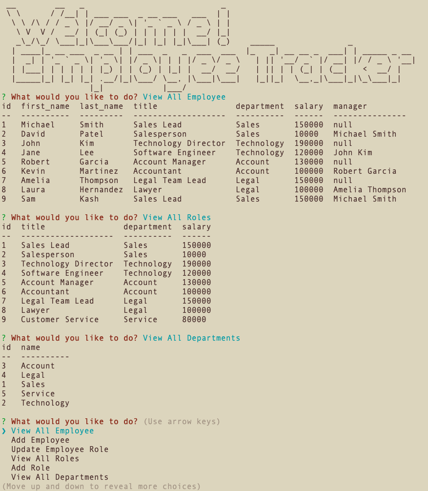

# Employee Tracker

## Description
Employee Tracker is a Node.js CLI application for managing a company's employee information including departments, roles, and employee details. It uses inquirer for user input and stores the information in a MySQL database. It allows for viewing, adding, and updating employees, roles, and departments.

## Table of Contents
- [Description](#Description)
- [Installation](#Installation)
- [Usage](#Usage)
- [Questions](#Questions)
## Installation
1. Clone this repository.
```
git clone git@github.com:oliviasylee/employee-tracker.git
```

2. Run ‘npm install’ from the terminal at the root directory of the local repository to install the required packages.
```
npm install mysql2 console.table inquirer figlet dotenv
```

3. Create a .env file in the root of your project folder and add the following environment variables with the values for your database connection:
```
DB_USER=your_database_username
DB_PASSWORD=your_database_password
DB_NAME=your_database_name
```

4. Save the file and run the following code in command line:
```
node index.js
```
## Usage

### Video Walkthrough
Here is a full movie showing how the application works. [Click here](https://drive.google.com/file/d/1lrOQnKvVpBigbDkkzEpfPUTJsnla88RQ/view) <br>
[](https://drive.google.com/file/d/1lrOQnKvVpBigbDkkzEpfPUTJsnla88RQ/view)
### Application User Interface
[](https://github.com/oliviasylee/employee-tracker)

## Questions
If you have any questions about this projects, please contact me at oliviasylee@Gmail.com. You can view more of my projects at https://github.com/oliviasylee.